# Comprehensive Plan for a Low-Latency Public-Satellite Wildfire Detection System for the Final XPRIZE Test

## Executive summary

The final test for entity["organization","XPRIZE","prize organization"]’s wildfire challenge (Track A) sets performance expectations that are exceptionally aggressive: detect all fires across a vast landscape within **~1 minute**, report with high confidence within **~10 minutes**, and push “high-resolution detection” toward **10 m² and smaller (ultimately ~1 m²)** while driving false positives below **~5%**. citeturn6view0turn6view1 Meeting these numbers *globally* using **only public satellite data** is fundamentally constrained by (1) sensor pixel sizes (especially geostationary thermal pixels measured in kilometers), (2) orbital revisit limits for high-resolution platforms, and (3) end-to-end distribution latency. citeturn24view0turn31view0turn25view0turn15view4

A pragmatic “best-possible with public data” system should be engineered around two realities:

1. **Ultra-low processing latency is achievable** (seconds) once data arrives, if you use push-based delivery and minimal preprocessing. This is most feasible for entity["organization","NOAA","us weather agency"] geostationary data on cloud mirrors (NODD) where cloud transfer adds **<1 second** and GOES end-to-end transfer to cloud can be **~tens of seconds** after product generation. citeturn18view0turn18view1  
2. **Ultra-small fire detectability (≈1–10 m²)** is only plausible with **high-resolution sensors** (e.g., Landsat-based active fire algorithms can detect fires “as small as a few square meters”), but those sensors are not continuous-watch and cannot guarantee a 1‑minute time-to-detection from ignition at global scale. citeturn22view2turn15view4turn24view1

Accordingly, the recommended competition-aligned design is a **two-tier satellite fusion system**:

- **Tier 1 (fast alerting):** ingest geostationary thermal imagery/products with push notifications and run fast thermal-anomaly + temporal filtering to generate a *preliminary alert* in seconds after arrival (best for moderate/large fires).  
- **Tier 2 (small-fire sensitivity + confirmation):** ingest the fastest available polar-orbiting active fire detections (VIIRS/MODIS “RT/URT” where available; otherwise NRT) and high-resolution, low-revisit sources (Landsat active fire; Sentinel-2 MSI fire/smoke cues) to confirm, sharpen location, estimate size/FRP trends, and reduce false positives. citeturn15view3turn24view2turn22view2turn31view0

This report inventories the public sensors and delivery pathways, quantifies latency ranges, and proposes an end-to-end architecture (with latency budgets) and an evaluation plan using public archives with simulated real-time constraints.

## What “few m² within ~1 minute” implies: constraints and realistic targets

The XPRIZE final test language implies three overlapping performance dimensions:

- **Time-to-detect:** “detect all fires … within 1 minute” and “report … within 10 minutes.” citeturn6view0turn6view1  
- **Spatial sensitivity:** “detect fires 10 m² and smaller … toward 1 m².” citeturn6view1  
- **False positives:** reduce to roughly **≤5%**. citeturn6view1  

### Sensor physics and minimum detectable fire size

For thermal anomaly detection, a fire smaller than a pixel can still be detected (sub-pixel detection) if its radiance is sufficiently intense relative to background. But the **minimum detectable fire area** is strongly tied to pixel size, view angle, atmospheric conditions, and the algorithm’s thresholds. citeturn24view0turn11view2

Publicly documented benchmarks show the fundamental scale gap:

- **Geostationary (GOES-class):** Theoretical minimum fire size at nadir is ~**0.004 km² (4,000 m²)** under favorable conditions. citeturn24view0  
- **Geostationary (Meteosat/SEVIRI-class):** Theoretical minimum for “actively burning” fires is ~**0.0009 km² (900 m²)** at nadir. citeturn24view0  
- **MODIS (1 km active fire):** “Routinely detects … fires **~1000 m²** in size.” citeturn24view0  
- **Landsat-derived active fire (30 m):** A NASA-described Landsat active fire algorithm “routinely detects fires as small as a **few square meters**, or smaller.” citeturn22view2turn22view2  

These numbers imply: **meter-scale fires (1–10 m²) are out of reach for geostationary and moderate-resolution polar active-fire products**, and are only plausible for high-resolution approaches (Landsat-like) *at the instant of overpass*. citeturn24view0turn22view2

### Latency ceilings from orbit and distribution

Even if detection compute is instantaneous, the earliest possible alert is bounded by:

- **Observation cadence** (e.g., 10-min full disk cycles for major geostationary imagers; limited mesoscale rapid sectors). citeturn23view2turn23view4  
- **Downlink and product generation** (especially for low-Earth orbit sensors that may not downlink globally in real time). For example, entity["organization","NOAA","us weather agency"] polar ground requirements indicate upstream SDR production within **~80 minutes**, and archived delivery to CLASS can be delayed **~6 hours** (configurable). citeturn25view0  
- **Public dissemination latency** (e.g., NASA FIRMS global NRT within ~3 hours; geostationary-derived detections in FIRMS ~20–30 minutes). citeturn15view3turn24view0turn24view1  

**Key feasibility conclusion (global, public-only):**  
A system can achieve **sub-minute processing after data arrival**, but it cannot guarantee **sub-minute detection from ignition** for **few‑m²** fires globally using public satellites alone. The best-achievable design is therefore to (1) maximize early detection for fires large enough to be visible to geostationary sensors, and (2) deliver the smallest-fire detections opportunistically at high-resolution overpass times (Landsat active fire), while aggressively managing false positives through fusion and temporal logic. citeturn24view0turn22view2turn6view1

## Public satellite sensor inventory and latency

### Table of geostationary sensors and near-real-time access

The table below emphasizes fire-relevant characteristics and public-latency realities. “Latency” is provided as **typical observed public availability** ranges and notes on variability drivers (scan cycle, licensing, and processing pipelines). citeturn23view4turn24view0turn18view0turn5view2turn11view0

| Sensor family | Coverage/orbit | Typical cadence | Nominal spatial resolution (fire-relevant IR) | Public/near-real-time latency ranges (ingest→available) | Lowest-latency public feed options | Expected minimum detectable fire size (order-of-magnitude) | Notes |
|---|---|---:|---:|---|---|---:|---|
| GOES-R series ABI (e.g., GOES‑18/19) | GEO (Americas, Pacific) | Full disk ~10 min; CONUS/PACUS ~5 min; mesoscale ~60s or ~30s (limited boxes) citeturn23view2turn23view4 | ~2 km IR at nadir citeturn23view4turn5view1 | **Seconds–minutes** once product exists in cloud mirrors; FIRMS geostationary detections typically **~20–30 min** post-observation citeturn18view0turn24view0 | **Cloud mirrors + push** (AWS NODD S3 + SNS), **direct broadcast** (GRB) citeturn18view1turn25view3turn25view4 | ~4,000 m² best-case theoretical citeturn24view0turn5view1 | NODD reports GOES cloud end-to-end transfer latency ~**24 s** (generation→cloud), with cloud-transfer overhead ~0.2–0.3 s. citeturn18view0 |
| Himawari AHI (Himawari-8/9) via JMA dissemination | GEO (Asia/Oceania, W. Pacific) | Full disk ~10 min (AHI baseline) citeturn9search8turn11view0 | Full AHI includes km-scale IR; HimawariCast subset includes many bands at ~4 km, and an IR channel at ~2 km at night citeturn11view0 | HimawariCast expects **~16–17 min** from observation start to receiving all segments; FIRMS derived detections ~**~30 min** citeturn11view0turn24view0 | **HimawariCast** (DVB); full imagery via HimawariCloud is primarily for NMHS organizations citeturn9search0turn11view0 | Similar to GOES-class (km-scale IR) citeturn24view0 | Full-resolution, lowest-latency access may require institutional arrangements; FIRMS provides a public derived product stream. citeturn9search0turn24view1 |
| Meteosat MSG/SEVIRI | GEO (Europe/Africa; IODC) | Full disk ~15 min; rapid-scan regional modes exist citeturn24view0turn26search16 | ~3 km at nadir for SEVIRI-class products (fire pixel uncertainty spans that pixel) citeturn24view1turn24view0 | FIRMS derived detections ~**~30 min**; direct EUMETSAT near-real-time access is constrained by licensing for <1h timeliness citeturn24view0turn5view2 | FIRMS derived products; **EUMETCast** multicast is EUMETSAT’s primary near-real-time dissemination system, but <1h timeliness typically requires a license/fee for “Recommended” data citeturn27view1turn5view2 | ~900 m² best-case theoretical citeturn24view0 | EUMETSAT policy: Meteosat “Recommended data” with latency ≥1h is without charge to end users; <1h requires annual flat fee. citeturn5view2 |
| MTG (FCI) “next generation” (context for finals timeframe) | GEO (Europe/Africa) | Full disk ~10 min; rapid-scan could be ~2.5 min (regional) citeturn26search16turn26search29 | Improved vs SEVIRI (km-class) citeturn26search16turn26search29 | Availability depends on EUMETSAT dissemination licensing; may not be “public realtime” in all channels/regions citeturn5view2turn27view1 | EUMETCast (licensed/controlled) citeturn27view1turn5view2 | Better than SEVIRI but not meter-scale | Include in roadmap as a potential improvement path; confirm public access and timeliness for your region well in advance. citeturn5view2turn27view1 |

### Table of polar-orbiting sensors for active fire detection and high-resolution characterization

| Sensor family | Orbit | Effective revisit (global, typical) | Fire-relevant bands/products | Public latency ranges (ingest→available) | Lowest-latency public feed options | Minimum detectable fire size (order-of-magnitude) | Notes |
|---|---|---:|---|---|---|---:|---|
| VIIRS (S‑NPP, NOAA‑20, NOAA‑21) | LEO sun-synchronous | ~2/day per satellite at low latitudes; more toward poles citeturn15view3turn24view1 | Active fire algorithms use mid-IR and thermal IR; VIIRS 375 m algorithm uses I4 (3.55–3.93 µm) + I5 (10.5–12.4 µm) and contextual tests citeturn11view2turn10view2 | Global FIRMS NRT typically **≤3 h**; FIRMS RT **≤30 min**, URT **≤5 min** (regional availability) citeturn15view3turn21search7 | **Direct broadcast** can yield **~5–15 min** after overpass (regional), or FIRMS US/Canada URT can be **<60 seconds** for much of the US/Canada via API citeturn21search2turn24view2 | Sub-pixel; sensitivity improved vs MODIS; small-fire detectability can extend to low FRP regimes (e.g., “small active fires” FRP ≤1 MW in literature) citeturn8search5turn11view2 | Best global “thermal fire” backbone. Use both point detections (fast) and radiance tiles (for verification). citeturn11view2turn15view3 |
| MODIS (Terra/Aqua) | LEO sun-synchronous | ~2/day per satellite (≈4/day combined) | Fire products derive primarily from 4 µm and 11 µm radiances citeturn14search13turn14search7 | FIRMS global NRT typically **≤3 h**; RT via direct broadcast can appear in FIRMS **~20–25 min** after observation (best-effort) citeturn15view3turn21search30 | Direct broadcast (where available); FIRMS | MODIS “routinely detects … fires ~1000 m²” citeturn24view0 | Useful redundancy and continuity; coarser than VIIRS. citeturn24view0turn15view3 |
| Sentinel‑3 SLSTR | LEO sun-synchronous | Multiple days; improves at higher latitudes | Thermal IR at 3.74, 10.85, 12 µm at ~1 km; includes FRP in product family citeturn25view2turn8search24 | Copernicus NRT classes are often “<3 h” in general program definitions; verify per product timeliness in your access endpoint citeturn29search0turn19search13 | Copernicus Data Space (STAC/openEO/S3); derived products via Copernicus ecosystems citeturn19search6turn19search13 | Similar order to MODIS/SEVIRI (km-scale thermal) | Valuable for FRP and continuity, but not a 1‑minute system. citeturn25view2turn29search0 |
| Landsat 8/9 (OLI/TIRS; “Landsat active fire” in FIRMS US/Canada) | LEO sun-synchronous | In mid-latitudes, each location ~8 days when combining Landsat 8 & 9 citeturn22view2 | High-resolution active fire algorithm can detect “few m² or smaller” (when overpass occurs) citeturn22view2 | Level-1 Real-Time scenes available **~4–6 h** after acquisition (USGS). citeturn15view4 | FIRMS US/Canada offers a Landsat NRT feed via APIs (requires MAP_KEY) citeturn24view2turn22view2 | Few m² (algorithm-level claim) citeturn22view2 | Best public source for “meter-scale” fire sensitivity, but revisit is sparse; use as confirmation/detail rather than universal early warning. citeturn22view2turn15view4 |
| Sentinel‑2 MSI (no thermal band) | LEO sun-synchronous | ~5-day revisit with two satellites (per common services) citeturn29search16 | 13 bands (10/20/60 m incl. SWIR 1.61 µm and 2.19 µm for fire/smoke/burn cues) citeturn25view1turn29search16 | Sentinel‑2 timeliness categories: Nominal **3–24 h**, NRT **100 min–3 h**, “Real-Time” ≤100 min (definitions; availability depends on architecture) citeturn31view0turn31view1 | Copernicus Data Space STAC + processing services; Sentinel Hub APIs (OAuth) citeturn19search6turn19search2 | Potentially small via SWIR saturation, but not guaranteed and not continuous | Use for smoke/burn scar corroboration and for improving geostationary localization via land-cover context; not a global 1‑minute detector. citeturn31view0turn25view1 |

## Access paths and latency optimization levers

### Latency classes you can actually control

In practice, “time-to-alert” is the sum of four components:

1. **Sensor cadence & view geometry** (fixed by satellite; can be optimized only by choosing sensors and sectors). citeturn23view4turn24view1  
2. **Downlink + product generation** (partly fixed; can be reduced by choosing direct-broadcast or faster processing tiers). citeturn25view0turn21search2turn15view2  
3. **Distribution to your compute** (highly controllable via cloud mirrors, multicast, and push notifications). citeturn18view0turn18view1turn27view1  
4. **Your ingestion + detection + alert runtime** (highly controllable; should target single-digit seconds).

### Concrete strategies to reduce effective latency

**Direct broadcast (biggest latency reduction where feasible)**  
- **GOES GRB** is a “full resolution, calibrated, near-real-time broadcast” of GOES-R Level 1b and related products, available to users with GRB receivers in view of GOES satellites. citeturn25view3  
- GRB specifications indicate high throughput (e.g., ~31 Mbps) and support rapid sectors (mesoscale down to ~30 seconds). citeturn25view4turn23view4  
- For LEO, direct broadcast + CSPP workflows can generate products with *typical* **5–15 min** latency after an overpass ends (regional, station-dependent). citeturn21search2turn20view1  

**Cloud mirrors + push delivery (largest operational reliability and simplest scaling)**  
- NOAA’s NODD program is designed so cloud transfer adds **<1 second** latency; for GOES-16, “end-to-end transfer latency” to public cloud is reported around **~24 seconds** once data are generated. citeturn18view0  
- The AWS Open Data listings for GOES and JPSS explicitly support **SNS “new object” notifications** (push), enabling event-driven ingestion rather than polling. citeturn18view1turn20view0  

**Use Level-1 products vs Level-2 products (speed vs effort trade-off)**  
- GOES processing pipelines distribute both L1b and L2+ products, and public internet distribution can serve users “with less stringent data availability requirements” without direct-broadcast infrastructure. citeturn15view2  
- For extreme low latency, **process L1b in the native sensor grid** (avoid reprojection), compute hot-spot likelihood quickly, and optionally backfill with official L2 fire products later.

**Exploit derived “active fire” services for fast, low-bandwidth detection streams**  
- entity["organization","NASA","us space agency"] FIRMS defines NRT/RT/URT classes and reports typical availability: NRT within ~3 hours (best effort), RT within ~30 minutes, URT within ~5 minutes. citeturn15view3turn21search7  
- FIRMS US/Canada APIs state that URT can be available in **<60 seconds** for much of the US and Canada (not global). citeturn24view2  

**Regional mirrors and “compute near the data”**  
- For NOAA data on AWS (US-East-1), co-locating processing in-region minimizes network jitter and enables true streaming ingestion via SNS. citeturn18view1turn20view0  
- For Copernicus, use the Copernicus Data Space APIs (STAC/openEO) and execute processing in the same ecosystem whenever possible to avoid large downloads and maximize timeliness. citeturn19search13turn19search6  

### Data access steps and application/registration requirements

Below is a concise, operational checklist of access paths aligned to low latency:

**NOAA GOES (cloud mirror + push)**  
- Use AWS Open Data S3 buckets and subscribe to the “NewGOES18Object” / “NewGOES19Object” SNS topics (push). citeturn18view1  
- The AWS listing states “new data is added as soon as it’s available” and provides licensing guidance (open use, attribution requested; no implied endorsement). citeturn18view1  

**NOAA JPSS (cloud mirror + push)**  
- Use AWS JPSS S3 buckets for NOAA‑20, NOAA‑21, and S‑NPP and subscribe to the associated SNS topics (push). citeturn20view0  
- Be aware of baseline system latencies: upstream SDR within ~80 minutes; CLASS archived delivery can be delayed ~6 hours (configurable). citeturn25view0turn20view1  

**NOAA CLASS (archive, not lowest latency)**  
- Register and use CLASS for historical and completeness; it is designed for archive access rather than minute-scale alerting. citeturn9search3turn9search7turn20view1  

**FIRMS APIs (derived active fire points, low bandwidth)**  
- Request a free **MAP_KEY** and use the API endpoints for area queries (CSV/SHP/KML/JSON). citeturn24view2  
- Use global FIRMS for worldwide monitoring (expect hours for NRT globally), and US/Canada endpoints if the competition geography aligns with that advantage (URT capability). citeturn15view3turn24view2turn21search7  

**Copernicus Data Space Ecosystem (Sentinel-2/3 and more)**  
- Use the STAC API endpoint described in Copernicus Data Space docs. citeturn19search6turn19search9  
- Practical timeliness expectations for Sentinel‑2 are defined as: Nominal 3–24 h; NRT 100 min–3 h; RT ≤100 min. citeturn31view0turn31view1  

**Sentinel Hub (processing as a service)**  
- Use its OAuth-based API authentication and processing APIs if you need server-side mosaicking / quick compute. citeturn19search2turn29search16  
- Remember this is a platform layer, not a sensor; it can reduce your compute latency and operational overhead but cannot change satellite acquisition constraints.

**EUMETSAT (Meteosat and dissemination)**  
- EUMETCast is described as EUMETSAT’s primary near-real-time dissemination system (“push” multicast) and part of GEONETCast. citeturn27view1  
- Licensing constraint is pivotal: EUMETSAT’s data policy indicates “Recommended” Meteosat data are without charge when latency is ≥1h, and <1h access generally requires an annual fee (and compliance with licensing terms). citeturn5view2  

**JMA Himawari distribution**  
- JMA distributes Himawari imagery via HimawariCast (broadcast) and HimawariCloud (full sets, primarily for NMHS partners). citeturn9search0  
- For HimawariCast, JMA documentation indicates full disk scan takes 10 minutes and expects ~16 minutes from observation start to receiving all segments. citeturn11view0turn9search8  

**GEONETCast**  
- GEONETCast is a global network of satellite-based dissemination systems (including components operated by NOAA and EUMETSAT). citeturn9search36turn27view1turn25view3  

**Commercial “open/free” archives and programs (non-proprietary use caveats)**  
- entity["company","Planet Labs","earth imaging company"] data can be accessible via public programs, but may be governed by an EULA and/or application processes; NASA’s CSDA notes Planet data are provided under a Planet end-user license and that “low latency requests” are situational and not guaranteed. citeturn7search11  
- These sources can help for *validation and characterization*, but they are typically not “public-domain” and can complicate strict “public-only” interpretations.

### Licensing and legal/usage constraints summary

- **NOAA data (via NODD/AWS):** open use; attribution requested; do not imply endorsement or affiliation. citeturn18view1turn20view0turn18view0  
- **Copernicus Sentinel data:** open access under Copernicus terms/conditions (worldwide access per policy). citeturn7search12turn28search21  
- **USGS Landsat:** public domain. citeturn7search1turn15view4  
- **NASA Earthdata / FIRMS:** open access with operational constraints (keys/rate limits; best-effort latency). citeturn24view2turn15view3turn21search11  
- **EUMETSAT Meteosat:** licensing can gate latency; <1h “Recommended” timeliness generally requires a paid license; ≥1h is broadly available without charge to end users. citeturn5view2turn27view1  
- **Himawari full datasets:** distribution can be institution-gated (HimawariCloud), whereas broadcast subsets (HimawariCast) are documented and region-dependent. citeturn9search0turn11view0  

## Detection and fusion methods for speed and false-positive control

A competition-grade approach should treat wildfire detection as a **streaming inference problem**: every incoming frame (or swath granule) is evaluated quickly, and hypotheses are refined as additional data arrive.

### Fast detection primitives by sensor type

**Geostationary thermal anomaly detection (fastest time resolution, coarsest pixels)**  
- **Goal:** detect *emergent, rapidly warming* subpixel anomalies soon after ignition *when large enough* to affect km-scale IR radiance. citeturn24view0turn23view4  
- **Core method:** contextual thermal tests + temporal persistence. FIRMS notes geostationary products can have significant commission/omission errors; FIRMS therefore filters to higher-confidence detections. citeturn24view1  
- **Trade-off:** fastest alerting, weakest for few‑m² fires, strongest for fires that grow quickly (and for monitoring growth once detected). citeturn24view1turn24view0  

**LEO thermal anomaly detection (VIIRS/MODIS/SLSTR; moderate cadence, better spatial detail)**  
- VIIRS 375 m active fire detection uses a hybrid strategy: fixed thresholds plus dynamically adjusted contextual tests, relying on mid‑IR and thermal IR channels (I4 and I5) to detect sub-pixel fire activity while reducing false alarms. citeturn11view2turn10view2  
- MODIS fire products are similarly based on 4 µm and 11 µm radiances and contextual background comparisons. citeturn14search13turn14search7  
- **Trade-off:** better minimum detectable size than geostationary, but not continuous; latency depends strongly on downlink and processing tier (URT/RT vs NRT). citeturn15view3turn24view2  

**High-resolution optical/SWIR detection (Landsat/Sentinel‑2)**  
- Landsat active fire algorithms can detect very small fires (few m²) at overpass time, but revisit is sparse. citeturn22view2  
- Sentinel‑2 lacks a thermal band; instead, exploit SWIR and smoke/burn cues at 10–20 m resolution, accepting that (a) small flaming fronts can saturate or be obscured, and (b) timeliness is generally measured in hours, not minutes. citeturn25view1turn31view0  

### Recommended fusion strategy: “fast trigger → refine → confirm”

To satisfy the XPRIZE combination of **speed** and **false-positive reduction**, implement a three-stage fusion logic:

1. **Trigger (seconds):**  
   - Run ultra-fast anomaly detection on the latest geostationary (or URT/RT polar) observations and output a *candidate event* with a conservative uncertainty ellipse (km-scale for geostationary). citeturn24view1turn24view0turn23view4  

2. **Refine (minutes):**  
   - Accumulate evidence across the next 2–3 frames (temporal filter): require persistence or increasing FRP/proxy intensity to reduce single-frame false alarms (sun glint, hot bare ground, noise).  
   - Out-of-the-box, FIRMS geostationary products already filter detections due to known commission/omission issues—your system can mimic this by using dynamic background models and conservative confidence gating. citeturn24view1turn11view2  

3. **Confirm (tens of minutes to hours, as available):**  
   - Cross-check with VIIRS/MODIS points from FIRMS (or your own processing) and, when overpass permits, with Landsat/Sentinel‑2 for higher-resolution localization and extent. citeturn15view3turn22view2turn31view0  

### Algorithmic approaches and their speed/false-positive trade-offs

**Thresholding + contextual tests (fastest, most transparent)**  
- Works well for VIIRS/MODIS-style detection (context windows, band differences, dynamic thresholds). citeturn11view2turn14search13  
- Pros: extremely fast, explainable, robust to small data volumes.  
- Cons: brittle across biomes/diurnal cycles; more false positives unless carefully tuned and cloud/surface masks are strong. citeturn24view0turn11view2  

**ML/CNN classification on small patches (high accuracy, controllable cost)**  
- Use ML only after the trigger stage: crop small windows around candidates (e.g., 32×32 or 64×64 pixels in sensor grid) and run a lightweight CNN to classify “fire vs non-fire.”  
- Pros: reduces false positives for complex backgrounds; can learn sensor-specific artifacts.  
- Cons: model drift between satellites/processing versions; requirements for labeled training data and careful calibration to achieve the XPRIZE false-positive constraints. citeturn24view1turn6view1  

**Anomaly detection and temporal filtering (best for streaming constraints)**  
- Maintain per-pixel seasonal/diurnal baselines, update continuously, and flag statistically significant deviations that persist.  
- Pros: strong for reducing false positives in deserts/urban heat; complements contextual thresholds.  
- Cons: needs bootstrapped baseline history and careful handling of rapid meteorological changes and cloud contamination. citeturn24view0turn31view0  

**Super-resolution / downscaling (use cautiously; helps localization more than existence detection)**  
- Downscaling km-scale IR using higher-resolution static priors (land cover, emissivity) can improve localization and perimeter inference, but it does not create new information about a 1 m² fire that never contributed measurable radiance to the original pixel. citeturn24view0turn25view2  
- In competition settings, treat super-resolution as a **visualization/localization enhancement** with explicit uncertainty, not as the core evidence of detection.

### Prioritized satellite sources to include, with expected latency and spatial sensitivity

The list below prioritizes sources that maximize (1) time-to-alert and (2) small-fire sensitivity under “public-only” constraints:

- **First priority: GOES ABI via NOAA cloud mirrors + push notifications** for the Western Hemisphere (fastest operational pipeline; supports event-driven processing). citeturn18view1turn18view0turn23view4  
  - Expected “data-arrival→alert” compute latency target: **<10 seconds** (your system).  
  - Expected “observation→availability on cloud” contribution: dominated by scan cycle (minutes) plus cloud transfer (~tens of seconds once generated). citeturn18view0turn23view4  
  - Spatial sensitivity: km-scale; theoretical minimum fire sizes in the **10³–10⁴ m²** range. citeturn24view0turn5view1  

- **Second priority: FIRMS harmonized geostationary detections (global)** as a safety net for Himawari/Meteosat coverage when direct NRT access is gated. citeturn24view1turn24view0  
  - Latency: typically **~20–30 minutes** post-observation. citeturn24view0turn24view1  

- **Third priority: VIIRS 375 m active fire (FIRMS URT/RT/NRT tiers)** as the global benchmark fire-detection stream. citeturn15view3turn11view2  
  - Latency: **<5 min URT** where available; **~30 min RT**; **≤3 h NRT** globally (best-effort). citeturn15view3turn24view2  
  - Spatial sensitivity: subpixel; better than MODIS; suitable for smaller fires than geostationary. citeturn11view2turn8search5  

- **Fourth priority: Landsat active fire (FIRMS US/Canada) for “few m²” events** (opportunistic). citeturn22view2turn24view2  
  - Spatial sensitivity: few m² at overpass time (algorithm claim). citeturn22view2  
  - Latency: depends on product stream; Level‑1 RT scenes are **4–6 hours**; the active-fire feed is “near real-time” but revisit remains the true limiter. citeturn15view4turn22view2  

- **Fifth priority: Sentinel‑2 MSI (10–20 m)** for smoke/extent corroboration and post-detection refinement; timeliness is typically **100 min–24 h** depending on service class (definitions). citeturn31view0turn25view1turn19search6  

## End-to-end architecture, latency budgets, experiments, and timeline

### Reference architecture

```mermaid
flowchart LR
  A[Satellite data sources] --> B[Low-latency delivery adapters]
  B --> C[Ingestion + metadata normalization]
  C --> D[Preprocessing in native sensor grid]
  D --> E[Fast detection stage: thresholds + temporal filter]
  E --> F[Fusion + event tracking]
  F --> G[Alerting: push (webhook/SMS/email)]
  F --> H[Operator UI + API]
  F --> I[Event store + audit logs]
  I --> J[Validation + scoring + retraining data]
```

### Implementation choices that minimize latency

**Ingestion and eventing**  
- Use SNS/SQS-style object notifications for NOAA GOES/JPSS buckets so your pipeline is *push-driven* (no polling delays). citeturn18view1turn20view0  
- For FIRMS, pull via their API endpoints (MAP_KEY-controlled rate limits), but schedule frequently enough to capture updates (FIRMS fire maps update every ~5 minutes; data packaging may update less often depending on format). citeturn15view3turn24view2  

**Preprocessing**  
- Avoid global reprojection in the hot path. Work in the sensor’s native projection/grid for detection, compute candidate coordinates, and only reproject small cutouts for UI display or cross-sensor fusion.  
- Prefer lightweight, “just-enough” calibration (e.g., brightness temperature conversion where necessary) rather than full atmospheric correction in the alert path. citeturn15view2turn11view2turn31view0  

**Detection compute**  
- Design a two-pass compute model:
  - Pass 1: SIMD/GPU-friendly threshold + contextual tests (milliseconds).  
  - Pass 2: candidate-only CNN (milliseconds–seconds).  
- Keep inference localized to candidate ROIs to preserve throughput even during major fire outbreaks.

### Latency budget targets

A practical latency budget should be expressed separately for each source class because “sensor latency” dominates.

| Stage | Budget target (compute you control) | Notes |
|---|---:|---|
| Push event receipt (SNS/webhook/SQS) | < 1 s | Achievable when co-located in-region with cloud bucket. citeturn18view1turn20view0 |
| Object fetch + decode | 1–5 s | Use streaming reads; parallelize by channel/segment. |
| Detection Pass 1 | < 500 ms per tile/sector | Threshold/context + temporal baselines. |
| Detection Pass 2 (candidate CNN) | 10–200 ms per candidate | Batch candidates; cap per cycle. |
| Fusion + dedup + scoring | < 1 s | Use in-memory state store (Redis-like) keyed by event ID. |
| Alert emission | < 1 s | Push notifications to downstream endpoints. |

Overall, you should aim for **<10 seconds** “data arrived in compute region → preliminary alert.” This aligns with the “1 minute” detection target **only if the competition’s time window is measured from data delivery** rather than from ignition, which is consistent with how some challenge evaluations are structured. citeturn6view0turn6view1turn18view0

### Hardware and cloud recommendations

- **Run compute in the same cloud region as the primary data mirror** (e.g., NOAA GOES/JPSS S3 buckets in AWS us-east-1 per the AWS registry pages). citeturn18view1turn20view0  
- Use a small GPU pool for ML-based confirmation, but keep the baseline detector CPU-optimized so it remains robust when GPU capacity is constrained.  
- Architect for *burst capacity* during major events—NODD is explicitly designed to scale to very high access loads without throttling. citeturn18view0  

### Experiments and evaluation plan using public archives with simulated latency

Because true ignition times are rarely known precisely from satellite alone, evaluate in two complementary modes:

**Archive-based replay with simulated delivery**  
- Reconstruct a “live feed” by replaying historical GOES/VIIRS/MODIS scenes in chronological order, injecting realistic distribution delays:
  - GOES (cloud mirror): tens of seconds after product generation (use NODD transfer latency as a reference). citeturn18view0  
  - FIRMS geostationary: ~20–30 minutes typical in FIRMS. citeturn24view0turn24view1  
  - FIRMS global NRT: up to ~3 hours best-effort; include variance. citeturn15view3turn21search7  

**Metrics (competition-aligned)**  
- **Detection time:** (alert timestamp − observation timestamp). Track distributions (median, p90, p99). Use the satellite observation time fields or granule times. citeturn15view3turn24view1  
- **Spatial accuracy:** distance error between your detected centroid and a high-confidence reference (e.g., FIRMS VIIRS points, Landsat active fire points where available). citeturn15view3turn22view2  
- **False positive rate:** fraction of alerts not corroborated within a defined time window by an independent sensor or by persistence tests. Target the XPRIZE false-positive constraint as an operational KPI. citeturn6view1turn24view1  
- **Event completeness:** probability of detection for classes of fires (size proxies: FRP bins, duration bins, biome bins). This matters because minimum detectable size varies strongly with conditions. citeturn24view0turn11view2  

### Development timeline

Given the short runway to a final test cycle, a staged deliverable plan reduces risk:

- **Phase A (data plumbing, two weeks):** Implement event-driven ingestion for NOAA GOES/JPSS via cloud mirrors + SNS, plus FIRMS API ingestion (MAP_KEY) with deduplication and persistent storage. citeturn18view1turn20view0turn24view2  
- **Phase B (baseline detection, two weeks):** Deploy fast thermal anomaly detectors for GOES ABI (native grid) and ingest VIIRS/MODIS active fire points. Validate end-to-end latency on replay streams. citeturn11view2turn24view0turn15view3  
- **Phase C (fusion + false-positive control, two weeks):** Add temporal filtering, multi-sensor corroboration, and candidate-only CNN. Tune confidence thresholds to approach the competition’s false-positive targets. citeturn6view1turn24view1  
- **Phase D (high-resolution enrichers, parallel):** Integrate Landsat active fire and Sentinel‑2/Sentinel‑3 for opportunistic confirmation and perimeter refinement with explicit timeliness labeling (do not treat these as universal early warning). citeturn22view2turn31view0turn25view2  

### Timeline diagram for latency-aware operations

```mermaid
gantt
  title End-to-end latency contributors (conceptual)
  dateFormat  HH:mm
  axisFormat  %H:%M

  section Geostationary (GOES-class)
  Scan cycle (full disk / CONUS / meso) :a1, 00:00, 00:10
  Product generation + cloud transfer    :a2, after a1, 00:01
  Ingestion + detection + alert          :a3, after a2, 00:00

  section Polar (VIIRS/MODIS)
  Overpass window                         :b1, 00:00, 00:05
  Downlink + processing (variable)         :b2, after b1, 00:80
  FIRMS NRT publication (best effort)      :b3, after b2, 00:60
  Ingestion + fusion + alert               :b4, after b3, 00:00

  section High-resolution (Sentinel-2 / Landsat)
  Overpass window                         :c1, 00:00, 00:05
  Timeliness class (100 min–24 h typical)  :c2, after c1, 03:00
  Refinement + validation                  :c3, after c2, 00:10
```



This diagram highlights why the architecture must label alerts by “timeliness class” and sensor lineage: the system can be truly low-latency for some sources (e.g., GOES cloud mirror + push), but inherently slower for others (Sentinel-2 nominal, Landsat Level‑1 RT). citeturn18view0turn31view0turn15view4turn15view3