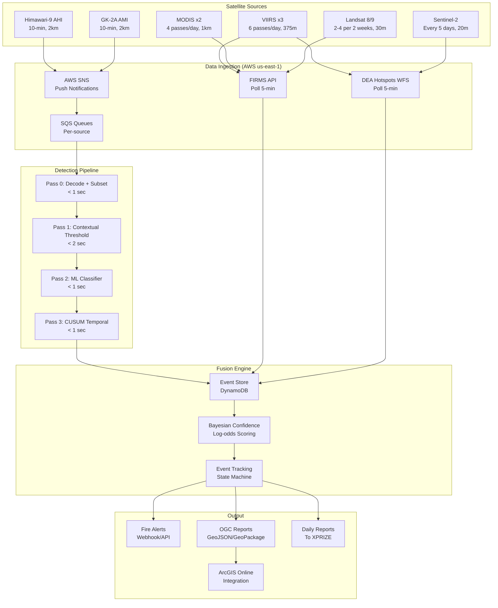

# XPRIZE Wildfire Track A Finals: Unified System Plan

**Version:** 1.0
**Date:** 2026-03-17
**Competition:** XPRIZE Wildfire Track A Finals, NSW Australia, April 9-21, 2026
**Team:** Northern Arizona University

---

## Executive Summary

We are building a satellite-based wildfire detection system for the XPRIZE Track A Finals in New South Wales, Australia. The system uses exclusively public satellite data to detect, characterize, and report wildfires across a ~800,000 km2 target area.

**Our strategy centers on three pillars:**

1. **Continuous geostationary monitoring** via Himawari-9 AHI with custom fire detection algorithms running on AWS, providing fire detection within 7-15 minutes of observation and characterization updates every 10 minutes.

2. **Sequential temporal detection (Kalman filter + CUSUM)** -- our competitive differentiator. By integrating evidence across multiple Himawari frames, we can detect fires of 200-500 m2 that are invisible to any single-frame geostationary algorithm. This pushes geostationary fire detection sensitivity 5-20x beyond conventional approaches.

3. **Multi-sensor fusion with Bayesian confidence scoring** combining Himawari, GK-2A, VIIRS, MODIS, Landsat, Sentinel-2, FIRMS, and DEA Hotspots into a unified event stream with rigorously controlled false positive rate (<5%).

**What we cannot do:** Hit the 1-minute-from-overpass metric for most observations. Our fastest detection is ~7 minutes (Himawari) or ~17 minutes (VIIRS via DEA Hotspots). Only a direct broadcast partnership (aspirational) or FarEarth Landsat deployment (aspirational) could achieve sub-minute detection.

**Our honest competitive assessment:** We will likely be outperformed on small-fire detection speed by teams with commercial satellite data (OroraTech). We will likely be outperformed on LEO detection timing by teams with direct broadcast ground station access. Our advantages are in algorithmic sophistication (temporal integration), false positive control, continuous characterization, and system robustness.

---

## System Architecture



---

## Sensor Priority Ranking

| Rank | Sensor | Role | Scoring Opportunities | Latency | Min Fire Size |
|------|--------|------|----------------------|---------|---------------|
| 1 | **Himawari-9 AHI** | Continuous trigger + characterization | 144 scans/day | 7-15 min | ~1,000-4,000 m2 single frame; ~200-500 m2 with CUSUM |
| 2 | **VIIRS (3 satellites)** | Primary LEO confirmation | ~6 passes/day | 17 min (DEA) to 3 hr (FIRMS) | ~100-500 m2 |
| 3 | **Landsat 8/9** | High-res opportunistic | 2-4 per 2 weeks | 4-6 hours | ~4 m2 |
| 4 | **GK-2A AMI** | Independent geostationary cross-check | 144 scans/day | ~7-15 min | Similar to Himawari |
| 5 | **MODIS (2 satellites)** | Supplementary LEO | ~4 passes/day | 17 min (DEA) to 3 hr (FIRMS) | ~1,000 m2 |
| 6 | **Sentinel-3 SLSTR** | FRP confirmation | ~2-4 passes/day | ~3 hours | ~1,000 m2 |
| 7 | **Sentinel-2 MSI** | Perimeter/burn scar | ~0.4 per day | 100 min - 3 hr | Limited (no thermal) |
| 8 | **FY-4B / FY-3D** | Tertiary redundancy | Variable | Unknown | Variable |

**Justification for ranking:**

Himawari is #1 because it provides continuous 24/7 coverage with the fastest operational data path (AWS NODD). It is our trigger layer and characterization backbone. VIIRS is #2 because its 375 m resolution provides the best active fire detection of any operational public sensor, and 6 daily passes give frequent scoring opportunities. Landsat is #3 despite sparse revisit because its 30 m resolution can detect fires of just a few square meters -- if an overpass aligns with a fire, the detection is far more valuable than a coarser sensor. GK-2A is #4 as an independent geostationary backup.

---

## Detection Pipeline Design

### Three-Pass Architecture

**Pass 1 -- Contextual Threshold Detection (~2 seconds per Himawari frame):**
- AHI-adapted contextual fire algorithm based on GOES FDC and VNP14IMG
- Nighttime: BT_B7 > 290 K AND BTD > 10 K, then contextual tests against 11x11 to 21x21 background window
- Daytime: BT_B7 > 315 K AND BTD > 22 K, adjusted for NSW autumn conditions
- Sun glint rejection for glint angle < 12 deg
- Output: candidate fire pixels with initial confidence

**Pass 2 -- ML Classifier (~0.5 seconds for all candidates):**
- Lightweight CNN (32x32x3 input, ~35K parameters, <5 ms/candidate)
- Applied ONLY to Pass 1 candidates
- Trained on FIRMS-labeled fire/non-fire patches from Black Summer 2019-2020
- Reduces false positives by ~80% with minimal true fire loss

**Pass 3 -- CUSUM Temporal Integration (~0.3 seconds for all NSW pixels):**
- Kalman filter models expected diurnal BT cycle per pixel
- CUSUM accumulates evidence for persistent positive anomalies
- Multi-scale: 3 detectors targeting fires of 50-100 m2, 200-500 m2, and 1,000+ m2
- Detection delay: ~2 hours for 500 m2 fire, ~11 hours for 200 m2 fire
- False alarm rate: ~1 per pixel per 6.5 days

**Total processing latency: ~6.5 seconds from data arrival to alert.**

### Sequential Temporal Detection: Our Competitive Edge

The Kalman + CUSUM approach is the single most important algorithmic innovation in our system. It exploits the physics of persistent fire signals vs. zero-mean noise to detect fires below the single-frame threshold.

**How it works:** A 200 m2 fire at 800 K produces a 0.15 K BT increase in a 3.5 km Himawari pixel -- below the 0.3-0.5 K noise floor of a single observation. But across 65 consecutive clear-sky observations (~11 hours), the signal accumulates to 65 x 0.15 K = 9.75 K of cumulative evidence while noise accumulates as sqrt(65) x 0.4 K = 3.2 K. The signal-to-noise ratio exceeds the detection threshold.

**Comparison to alternatives:**
- RST-FIRES (ALICE): simpler (lookup table), equally effective for large fires, but requires multi-year archive and cannot adapt to real-time conditions. We use RST-style pre-computed statistics to initialize our Kalman states.
- GOES FDC temporal filter: simple 2-detection persistence test. Catches ~33% more fires than single-frame but cannot detect sub-threshold fires. Our CUSUM is strictly more powerful.

**Key limitation:** Sequential detection requires clear-sky persistence. Under 80% cloud cover, most pixel time series are fragmented and CUSUM evidence decays during gaps.

---

## Fusion and Confidence Strategy

### Bayesian Log-Odds Framework

Each evidence source contributes a log-likelihood ratio to the cumulative fire probability:

```
P(fire) = sigmoid(prior_log_odds + sum(LLR_evidence))
```

**Key LLR values:**
- AHI strong anomaly: +4.0
- Persistent across 3 frames: +2.0
- CUSUM threshold exceeded: +2.0
- VIIRS high-confidence match: +4.0
- GK-2A independent detection: +2.5
- Landsat thermal anomaly: +5.0
- Sun glint zone: -3.0
- Known industrial site: -4.0

### Confidence Tiers and Reporting Rules

| Tier | P(fire) | Action |
|------|---------|--------|
| HIGH (>0.85) | Report immediately | AHI persistent + VIIRS confirm |
| NOMINAL (0.50-0.85) | Report with caveat | AHI persistent, awaiting LEO |
| LOW (0.20-0.50) | Monitor internally | Single AHI frame, moderate anomaly |
| REJECTED (<0.20) | Suppress from output | Failed persistence or known FP |

### False Positive Control (<5% Target)

Six-layer filtering pipeline:
1. Static masks (land/water, urban, industrial) -- free, eliminates ~20% of FPs
2. Geometric filters (sun glint, VZA limits) -- milliseconds, eliminates ~15% more
3. Contextual detection (adaptive thresholds) -- ~1 second, eliminates ~80% of remaining
4. ML classifier -- ~0.5 second, eliminates ~80% of remaining
5. Temporal persistence (2/3 frames) -- ~20 minutes, eliminates ~80% of remaining
6. Cross-sensor confirmation -- hours, near-zero FP rate

Expected result: <1 false positive per day among reported fires, well within the 5% target.

**Emergency FP reduction:** If FP rate exceeds 5%, escalate through raising thresholds, night-only geostationary detection, requiring VIIRS confirmation, and finally manual review.

---

## Partnership Requirements

### Must-Have (Available Now, No Partnership Needed)

| Resource | Access Path | Status |
|----------|-----------|--------|
| Himawari-9 data | AWS NODD S3 bucket | Public, available |
| GK-2A data | AWS NODD S3 bucket | Public, available |
| VIIRS/MODIS fire detections | DEA Hotspots WFS | Public, no registration |
| VIIRS/MODIS fire detections | FIRMS API (MAP_KEY) | Free registration |
| Himawari NRT data | JAXA P-Tree | Free registration |
| Landsat data | USGS/AWS | Public domain |
| Sentinel-2/3 data | Copernicus Data Space | Free registration |
| AWS compute (us-east-1) | AWS account | Team account |

### Nice-to-Have (Significant Competitive Advantage)

| Partner | What They Provide | Latency Gain | Probability |
|---------|------------------|-------------|-------------|
| GA (DEA Hotspots team) | Faster VIIRS data feed | ~17 min -> ~10 min | 60% |
| BoM Satellite Operations | Direct broadcast VIIRS SDR | ~17 min -> ~5 min | 30% |
| CfAT/Viasat Alice Springs | Ground station access | Variable | 20% |
| OroraTech | Commercial thermal alerts | Adds ~200m, 30-min thermal | 15% |

### Aspirational (Low Probability, High Reward)

| Partner | What They Provide | Impact | Probability |
|---------|------------------|--------|-------------|
| GA Alice Springs + FarEarth | Real-time Landsat fire detection | <10 sec Landsat = competition-defining | 5% |
| BoM internal Himawari feed | Faster than public mirror | Shave 2-5 min off latency | 10% |

**Recommendation:** Build the system to work with must-have resources only. Pursue nice-to-have partnerships in parallel but do not make them load-bearing. Any partnership that materializes is pure upside.

---

## Implementation Timeline

**Today: March 17, 2026. Competition: April 9-21, 2026. Time remaining: ~23 days.**

### Week 1 (Mar 17-23): Data Plumbing

- [x] Register for all APIs (FIRMS, JAXA P-Tree, Copernicus, NASA Earthdata)
- [ ] Set up AWS account in us-east-1
- [ ] Subscribe to Himawari SNS notifications
- [ ] Build SQS -> Lambda filter pipeline for AHI B07/B14
- [ ] Build FIRMS API polling client
- [ ] Build DEA Hotspots WFS polling client
- [ ] Test end-to-end data flow: SNS -> decode -> basic BT conversion

### Week 2 (Mar 24-30): Core Detection

- [ ] Implement Pass 1: contextual threshold fire detection on AHI
- [ ] Implement cloud masking (fast Tier 1)
- [ ] Build event store (DynamoDB) with spatial indexing
- [ ] Implement Bayesian confidence scoring
- [ ] Implement OGC output format (GeoJSON)
- [ ] Begin Kalman filter initialization from Himawari archive
- [ ] Submit Finals Application (CONOPS, AI/ML Plan, System Diagram) by March 31

### Week 3 (Mar 31 - Apr 6): Integration + ML + CUSUM

- [ ] Train ML classifier (Pass 2) on Black Summer + NSW fire data
- [ ] Implement CUSUM temporal detection (Pass 3)
- [ ] Integrate all sources into fusion engine
- [ ] Build ArcGIS Online integration
- [ ] Build daily report generator
- [ ] Historical replay testing (April 2023-2025 fire seasons)
- [ ] Compute overpass schedules from fresh TLEs

### Week 4 (Apr 7-8): Pre-Competition Readiness

- [ ] Travel to NSW
- [ ] Final TLE refresh and overpass schedule computation
- [ ] Initialize Kalman filter states from 2 weeks of recent Himawari data
- [ ] End-to-end system test with live data
- [ ] Verify ArcGIS Online integration
- [ ] Prepare emergency fallback procedures
- [ ] Load static masks (industrial sites, land cover, water bodies)

### Competition (Apr 9-21): Operations

- [ ] Monitor system 24/7
- [ ] Daily report submission by 20:00 AEST
- [ ] Manual review of alerts if FP rate is concerning
- [ ] Daily TLE refresh for overpass predictions
- [ ] Adapt thresholds if needed based on early results

---

## Risk Register

| # | Risk | Likelihood | Impact | Mitigation | Owner |
|---|------|-----------|--------|-----------|-------|
| 1 | Himawari data feed fails | LOW | CRITICAL | GK-2A + JAXA P-Tree backup | Eng |
| 2 | AWS us-east-1 outage | LOW | CRITICAL | JAXA/FIRMS/DEA fallback paths | Eng |
| 3 | FP rate > 5% | MODERATE | HIGH | 6-layer filtering + emergency protocols | Algo |
| 4 | Cloud cover > 70% during competition | MODERATE | HIGH | Cannot mitigate (physics); same for all teams | - |
| 5 | Small fires (<500 m2) missed | HIGH | MODERATE | CUSUM temporal integration | Algo |
| 6 | All partnerships fail | HIGH | MODERATE | System works on public data alone | Lead |
| 7 | CUSUM state lost (DB failure) | LOW | MODERATE | Pre-init + persistent storage + snapshots | Eng |
| 8 | OGC/ArcGIS integration breaks | LOW | HIGH | Test extensively pre-competition | Eng |
| 9 | Competition rules misunderstood | LOW | HIGH | Attend all calls, over-declare sources | Lead |
| 10 | Competitor has commercial data | HIGH | MODERATE | Differentiate on algorithms, not data | Lead |
| 11 | Timeline too aggressive (23 days) | HIGH | CRITICAL | Prioritize MVP; CUSUM and ML are stretch goals | Lead |
| 12 | Himawari HSD decode too slow | LOW | MODERATE | Benchmark early; fallback to satpy library | Eng |

---

## Open Questions Requiring Answers

1. **Does the 1-minute metric apply to geostationary scans?** If each Himawari scan counts as an "overpass" with its own 1-minute clock, we cannot score on this metric (7-15 min latency). If only LEO passes count, we have 6 VIIRS scoring opportunities per day at ~17 min latency. Clarify with XPRIZE.

2. **How are prescribed burns vs. wildfires scored?** The rules say "detect all fires." Prescribed burns (hazard reduction burns) are real fires -- do we get credit for detecting them? Or only XPRIZE-ignited competition fires?

3. **What is the actual Himawari AWS NODD latency?** We estimate 7-15 minutes but need to measure empirically during Week 1. If consistently >15 minutes, consider switching to JAXA P-Tree as primary.

4. **Can we access DEA Hotspots underlying data?** The WFS provides point detections. Can we access the underlying Himawari/VIIRS imagery from GA's processing pipeline? This would give us faster-than-public Himawari data without a formal partnership.

5. **What is the CUSUM residual sigma achievable in practice?** Our performance estimates assume 0.3-0.8 K residual standard deviation after DTC subtraction. The actual value determines whether CUSUM can detect 200 m2 fires in 11 hours (sigma = 0.4 K) or 22+ hours (sigma = 0.8 K). Must characterize empirically.

6. **Is our 23-day timeline realistic?** The implementation plan is aggressive. If CUSUM and ML are not ready by competition, can we win with contextual detection + temporal persistence + fusion alone? Probably not win, but competitive.

7. **Should we pursue OroraTech as a commercial data partner?** Their constellation provides the exact capability we lack (sub-30-min thermal revisit at ~200 m). But "public data only" may be interpreted to exclude commercial services. Clarify with XPRIZE.

---

## Architectural Decisions Log

| Decision | Rationale | Alternative Considered |
|----------|-----------|----------------------|
| Process in native sensor grids | Avoids reprojection latency (~5 sec savings) and interpolation artifacts | Reproject to common grid for fusion -- rejected for speed |
| Himawari via AWS NODD (not JAXA P-Tree) | Push notifications via SNS enable event-driven pipeline; P-Tree requires polling | JAXA P-Tree as primary -- reserved as backup |
| Kalman + CUSUM over RST-FIRES (ALICE) | Adapts in real-time; no multi-year archive dependency; optimal detection delay | RST-FIRES is simpler but requires historical archive construction |
| Bayesian log-odds over Dempster-Shafer | Simpler, well-understood, handles conditional independence assumption | D-S handles conflicting evidence better but more complex |
| Lightweight CNN over transformer/foundation model | <5 ms inference on CPU; no GPU dependency; sufficient for binary fire/no-fire | Large models could improve accuracy but require GPU and more training data |
| DynamoDB over PostgreSQL/PostGIS for event store | Serverless, auto-scaling, sub-millisecond reads at competition scale | PostGIS has better spatial query support but requires instance management |
| Report ALL fires (including prescribed burns) | Rules say "detect all fires"; any correct detection helps score | Only report competition fires -- but we cannot know which are competition fires |

---

## Conclusion

This system plan is designed to be buildable in 23 days by a small team, operational on day one of the competition, and differentiated by algorithmic innovation rather than data access advantages. The Kalman + CUSUM temporal detection approach is our primary competitive edge -- if it works as theoretically predicted, it gives us geostationary fire detection sensitivity 5-20x better than conventional single-frame algorithms.

The system is robust to partnership failures (works on public data alone), cloud cover (degrades gracefully, same as all teams), and data feed interruptions (multiple fallback paths). The primary risks are timeline pressure (23 days is tight for ML + CUSUM implementation) and the inherent resolution limitations of geostationary data for small fire detection.

Our strategy is to be the team with the lowest false positive rate, the most continuous monitoring, and the most sophisticated use of geostationary temporal data. We accept that we may not be the fastest to detect each individual fire, but we aim to be the most reliable and comprehensive across the full competition window.
