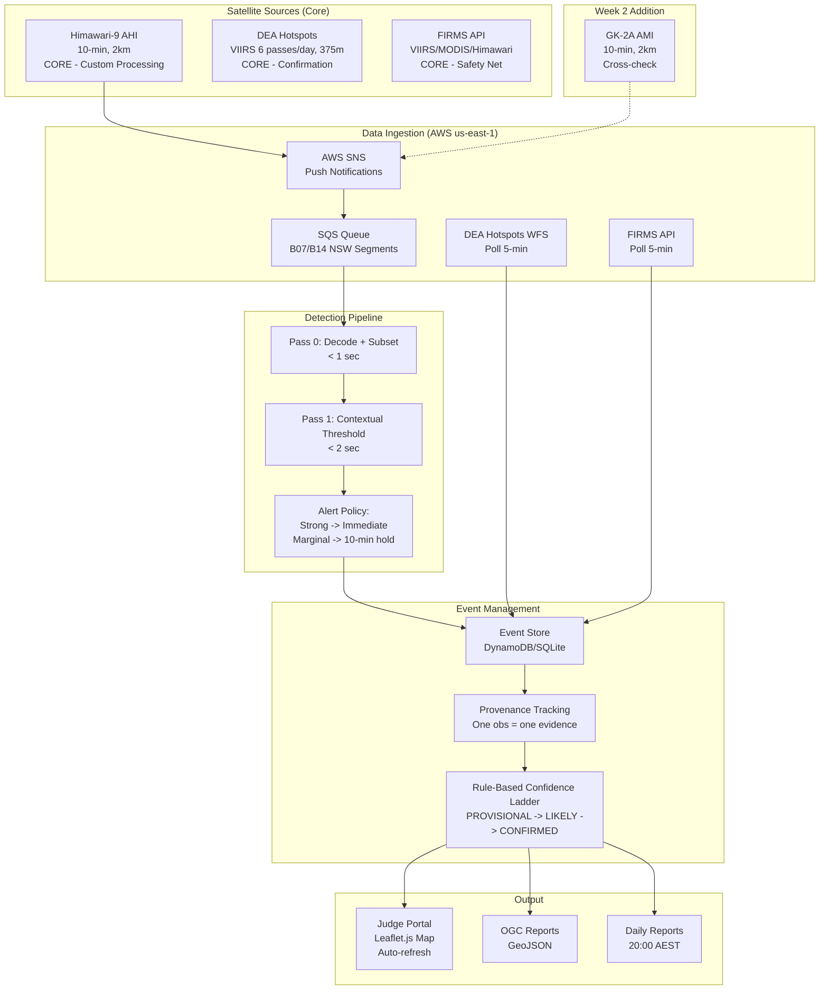

# XPRIZE Wildfire Track A Finals: Unified System Plan

**Version:** 2.0
**Date:** 2026-03-18
**Competition:** XPRIZE Wildfire Track A Finals, NSW Australia, April 9-21, 2026
**Team:** Northern Arizona University

---

## Executive Summary

We are building a satellite-based wildfire detection system for the XPRIZE Track A Finals in New South Wales, Australia. The system uses public satellite data to deliver the fastest, cleanest, most trustworthy fire intelligence possible, detecting, characterizing, and reporting wildfires across a ~800,000 km2 target area.

**Our strategy centers on three pillars:**

1. **Immediate alerting from geostationary monitoring** via Himawari-9 AHI with contextual fire detection running on AWS. Strong thermal anomalies are reported as provisional alerts within minutes of observation. Marginal detections are held for one confirmation frame (10 min) before reporting.

2. **Rule-based confidence ladder** with clear provenance tracking. Detections move through PROVISIONAL -> LIKELY -> CONFIRMED states based on transparent, debuggable rules. One observation = one evidence contribution, regardless of how many processing pipelines touch it.

3. **Multi-source corroboration** combining our custom Himawari processing with DEA Hotspots (VIIRS at ~17 min) and FIRMS as a safety net, producing a unified event stream with rigorously controlled false positive rate (<5%).

**Our insurance policy:** A fallback system (DEA Hotspots + FIRMS polling) is built FIRST, before any custom detection code. If our entire custom Himawari pipeline fails, judges still see fire detections on our portal within minutes.

**What we cannot do:** Hit the 1-minute-from-overpass metric for most observations. Our fastest detection is ~7 minutes (Himawari) or ~17 minutes (VIIRS via DEA Hotspots). Only a direct broadcast partnership (aspirational) could achieve sub-minute detection.

**Our honest competitive assessment:** We will likely be outperformed on small-fire detection speed by teams with commercial satellite data (OroraTech). We will likely be outperformed on LEO detection timing by teams with direct broadcast ground station access. Our advantages are in system robustness (fallback system + custom pipeline), false positive control, continuous characterization, and honest, transparent reporting that judges can trust.

---

## What We Learned from External Review

An external review (ChatGPT Pro deep analysis, 2026-03-17) identified several critical flaws in our v1.0 plan:

1. **CUSUM was overclaimed as our "competitive edge."** The detection delays (2-11 hours for 200-500 m2 fires) mean CUSUM adds nothing for fires large enough for single-frame detection, and takes too long for fires that VIIRS would catch anyway. CUSUM's sweet spot is narrow.

2. **Bayesian log-odds suffered from double-counting.** The same Himawari observation processed by our pipeline, FIRMS, and DEA Hotspots was being summed as three independent evidence contributions. This inflated confidence and violated conditional independence assumptions.

3. **No fallback system.** If the custom Himawari pipeline failed during competition, we had no backup. A system that detects fires but cannot show them to judges is worth zero.

4. **Judge portal was deprioritized.** The portal was scheduled for Week 3-4 in the original plan. The portal IS the product -- judges experience our system through it.

5. **Overclaiming on characterization.** "Perimeter" and "rate of spread" from sparse geostationary hotspot centroids is decorative, not operational. Honest uncertainty reporting is better.

6. **Scope was too broad.** Eight sensor tiers with 22 days to build is not realistic. The plan needed ruthless focus.

**How we responded:** Complete plan restructure. CUSUM and ML classifier demoted to optional stretch goals. Bayesian scoring replaced with rule-based confidence ladder. Fallback system and judge portal moved to Priority 1-2. Sensor scope cut to Himawari + DEA Hotspots + FIRMS core, with GK-2A as a Week 2 cross-check. Characterization claims made honest.

---

## System Architecture



**Note:** Dashed line for GK-2A indicates Week 2 addition, not Week 1 core.

---

## Sensor Stack

### Core (Must-Have, Week 1)

| Sensor | Role | Latency | Min Fire Size |
|--------|------|---------|---------------|
| **Himawari-9 AHI** | Continuous trigger + characterization, 144 scans/day | 7-15 min | ~1,000-4,000 m2 |
| **VIIRS via DEA Hotspots** | Primary LEO confirmation, 6 passes/day | ~17 min | ~100-500 m2 |
| **FIRMS API** | Safety net, catches anything DEA misses | 30 min - 3 hr | Variable |

### Week 2 Addition (Low-Effort, Real Value)

| Sensor | Role | Latency | Min Fire Size |
|--------|------|---------|---------------|
| **GK-2A AMI** | Independent geostationary cross-check, different viewing angle | ~7-15 min | Similar to Himawari |

### Dropped (Insufficient Time or Marginal Value)

| Sensor | Reason for Dropping |
|--------|-------------------|
| Sentinel-3 SLSTR | ~3 hour latency, adds nothing over DEA Hotspots |
| FY-4B | Data access unreliable from NSMC, adds complexity |
| FY-3D MERSI | NSMC data access risk we cannot take in 22 days |
| Raw VIIRS processing | Direct broadcast partnership is aspirational, not load-bearing |
| Landsat real-time | FarEarth/Alice Springs partnership not viable at this timeline |
| Sentinel-2 real-time | 5-day revisit, no thermal band, marginal value |
| MODIS (separate processing) | Redundant with VIIRS, same orbits, coarser resolution |

**Justification:** Himawari is #1 because it provides continuous 24/7 coverage with the fastest operational data path (AWS NODD with SNS push). DEA Hotspots is #2 because it provides VIIRS fire detections at ~17 min latency with zero engineering effort (WFS API, no registration). FIRMS is the safety net. GK-2A is a Week 2 addition because the AWS NODD mirror already exists and the incremental cost is trivial once Himawari works.

---

## Alert Policy

### Tiered Immediate Alerting

The previous plan held first detections for 20-30 minutes waiting for persistence. This is backwards for a speed competition where "low confidence detections still count if correct" (per the 2026-03-17 all-teams call clarification).

**Tier 1 -- Immediate, HIGH confidence:**
- Saturated pixels (BT >= 400 K) or extreme anomalies (BT_B7 > 360 K night)
- Near-zero false positive risk
- Report immediately

**Tier 2 -- Immediate, PROVISIONAL confidence:**
- Strong contextual detections (BTD > mean + 5*sigma)
- Low false positive risk
- Report immediately as PROVISIONAL

**Tier 3 -- 10-minute hold, then PROVISIONAL:**
- Marginal contextual detections (BTD > mean + 3.5*sigma but < 5*sigma)
- Hold for one additional frame (10 min). If persists, report as PROVISIONAL
- Balances speed against credibility

**Key safeguard:** All reports clearly distinguish PROVISIONAL from CONFIRMED. Judges see "PROVISIONAL: thermal anomaly detected at [location], [time], awaiting confirmation" vs "CONFIRMED: fire detected at [location], corroborated by [sensors]."

---

## Detection Pipeline Design

### Minimum Viable Pipeline (Week 1 Deliverable)

The core detection pipeline has two passes, not three. ML classifier and CUSUM are optional stretch goals for Week 3.

**Pass 0 -- Preprocessing (<1 second):**
- Decode Himawari HSD format for Band 7 (3.9 um) and Band 14 (11.2 um), NSW segments only
- Convert raw counts to brightness temperature
- Apply pre-computed land/water mask
- No atmospheric correction, no reprojection

**Pass 1 -- Contextual Threshold Detection (<2 seconds):**
- AHI-adapted contextual fire algorithm based on GOES FDC and VNP14IMG
- Static masks (land/water, known industrial sites from FIRMS STA)
- Sun glint rejection (glint angle < 12 deg)
- Fast cloud mask (Tier 1: BT_11 < 265K, simple tests)
- Contextual background characterization (11x11 to 21x21 window)
- Alert generation with lat/lon, confidence tier, timestamp

**Total processing latency: ~3-5 seconds from data arrival to alert.**

See `detection-pipeline.md` for full algorithm details.

### Optional Enhancements (Week 3 Stretch Goals)

**ML Classifier (Pass 2):** Lightweight CNN on AHI fire candidates, trained on FIRMS-labeled fire/non-fire patches. Reduces false positives by ~80%. Only implement if FP rate is concerning after Week 2 testing.

**CUSUM Temporal Detection (Pass 3):** Kalman filter + CUSUM as shadow layer, run in parallel with contextual detection. Potentially detects fires of 200-500 m2 that are invisible to single-frame detection. Pre-initialize from 2 weeks of Himawari archive. Only implement if core pipeline is stable.

---

## Confidence and Fusion Strategy

### Rule-Based Confidence Ladder

Replaces the Bayesian log-odds framework from v1.0. Simpler, debuggable, buildable in a day.

```
LEVEL 1 - PROVISIONAL (report immediately):
  Single AHI frame, passes contextual tests

LEVEL 2 - LIKELY (report with moderate confidence):
  AHI persistent 2/3 frames, OR
  AHI single frame + GK-2A independent detection

LEVEL 3 - CONFIRMED (report with high confidence):
  AHI detection + VIIRS/MODIS detection within spatial match radius, OR
  AHI persistent 3/3 frames AND growing intensity

LEVEL 4 - HIGH CONFIDENCE:
  Multiple independent sensor confirmations (AHI + VIIRS + FIRMS NRT all agree)

RETRACTED:
  Single AHI frame, NOT confirmed in next 2 frames, no LEO confirmation within 6 hours
```

### Event Lifecycle

```
PROVISIONAL -> LIKELY -> CONFIRMED -> MONITORING -> CLOSED
     |            |
     +-> RETRACTED +-> RETRACTED
```

- **PROVISIONAL:** First detection. Report immediately with low confidence.
- **LIKELY:** Passed persistence or independent confirmation. Upgrade report.
- **CONFIRMED:** LEO sensor confirmation or multiple independent detections.
- **MONITORING:** Fire confirmed, providing characterization updates for 12 hours per Rule 9.
- **RETRACTED:** Failed persistence, no confirmation. Mark as retracted.
- **CLOSED:** 12 hours elapsed or fire extinguished.

### Provenance Tracking (Fixes Double-Counting)

**Rule 1: One observation = one evidence contribution.** When the same satellite observation is processed by multiple pipelines (our custom, FIRMS, DEA), take the maximum confidence, not the sum.

**Rule 2: Independence requires different sensors or different times.** True independent evidence comes from different satellites, different sensor types, or the same satellite at different times.

**Rule 3: Every piece of evidence records:**
- Source satellite
- Observation time
- Processing pipeline (custom, FIRMS, DEA)
- Whether it is PRIMARY or DERIVED from a primary

See `fusion-confidence.md` for full details.

### False Positive Control (<5% Target)

Four-layer filtering pipeline (core MVP):
1. Static masks (land/water, urban, industrial) -- free, eliminates ~20% of FPs
2. Geometric filters (sun glint, VZA limits) -- milliseconds, eliminates ~15% more
3. Contextual detection (adaptive thresholds) -- ~1 second, eliminates ~80% of remaining
4. Temporal persistence (2/3 frames) -- ~10-20 minutes, eliminates ~80% of remaining

Optional additions (Week 3):
5. ML classifier -- ~0.5 second, eliminates ~80% of remaining
6. Cross-sensor confirmation -- hours, near-zero FP rate

**Emergency FP reduction:** If FP rate exceeds 5%, escalate through raising thresholds, night-only geostationary detection, requiring VIIRS confirmation, and finally manual review.

---

## Characterization: Honest and Useful

The R&R asks for "fire behavior including perimeter, direction and rate of spread, and intensity." We provide simple characterization that is honest about its limitations:

| Field | What We Provide | What We Do NOT Claim |
|-------|----------------|---------------------|
| Location | Point with uncertainty circle (~2-3 km for AHI) | Precise perimeter polygon |
| Size | "Detection covers approximately X km2 based on hot pixel count" | Precise area measurement |
| Intensity | Qualitative (low/moderate/high) based on BT anomaly magnitude | Quantitative FRP from geostationary |
| Direction/ROS | Only if 3+ sequential detections show centroid movement | Decorative arrows from 2 points |
| Confidence | PROVISIONAL/LIKELY/CONFIRMED (intuitive) | P(fire) = 0.73 (opaque) |

Label everything "estimated" not "measured." Judges will respect honesty more than overconfident claims.

---

## Partnership Strategy

### Available Now (No Partnership Needed)

| Resource | Access Path | Status |
|----------|-----------|--------|
| Himawari-9 data | AWS NODD S3 bucket + SNS | Public, available |
| GK-2A data | AWS NODD S3 bucket | Public, available |
| VIIRS/MODIS fire detections | DEA Hotspots WFS | Public, no registration |
| VIIRS/MODIS fire detections | FIRMS API (MAP_KEY) | Free registration |
| Himawari NRT data | JAXA P-Tree | Free registration (backup) |

### Partnership Opportunities (Emails Sent Day 1)

| Partner | What They Provide | Probability | Notes |
|---------|------------------|-------------|-------|
| BoM | HimawariRequest Target Area (2.5-min cadence) | 10-15% | Game-changing if approved, but low probability. One email to satellites@bom.gov.au |
| OroraTech | Commercial thermal alerts during competition | 10-20% | Fills our biggest gap (small fires between VIIRS passes). Not "public data" but R&R allows legally-sourced data |
| GA | Faster DEA Hotspots access | 20-30% | Priority API or raw data feed |

### Not Pursuing

| Partner | Reason |
|---------|--------|
| Earth Fire Alliance / FireSat | Not operational until mid-2026 |
| FarEarth / Pinkmatter | Landsat real-time not viable at this timeline |
| CfAT / Viasat | Commercial GSaaS adds complexity we cannot absorb |

**Design principle:** The system works entirely on public data. Any partnership that materializes is pure upside, not load-bearing.

---

## Implementation Timeline

**Today: March 18, 2026. Competition: April 9-21, 2026. Time remaining: 22 days.**
**CONOPS deadline: March 31, 2026.**

### Priority 1: Fallback System + Judge Portal (Days 1-2, Mar 18-20)
- DEA Hotspots WFS polling (every 5 min)
- FIRMS API polling (every 5 min, requires MAP_KEY)
- Simple deduplication by spatial proximity (2 km grid)
- GeoJSON export
- Basic web portal (Leaflet.js map, auto-refresh, colored dots by confidence)
- **This is our insurance policy. If everything else fails, this works.**

### Priority 2: Himawari Raw Pipeline + Contextual Detection (Days 2-7, Mar 19-24)
- AWS account in us-east-1
- Subscribe to Himawari SNS notifications
- SQS queue with filter for B07/B14, NSW segments
- HSD decode + BT conversion (satpy or custom decoder)
- Static masks (land/water, industrial sites)
- Sun glint rejection
- Contextual threshold fire detection (adapted GOES FDC for AHI)
- Cloud mask (Tier 1: simple BT thresholds)
- Alert generation with lat/lon, confidence, timestamp

### Priority 3: Event Store + Confidence Ladder + Portal Integration (Days 5-10, Mar 22-27)
- Event store (DynamoDB or SQLite)
- Provenance tracking (satellite, pipeline, observation time)
- Rule-based confidence ladder (PROVISIONAL -> LIKELY -> CONFIRMED)
- Portal shows custom Himawari detections alongside DEA/FIRMS fallback
- Retraction logic for single-frame transients
- OGC GeoJSON export with proper schema

### Priority 4: DEA/FIRMS Integration as Confirmation Layer (Days 7-12, Mar 24-29)
- Cross-match DEA Hotspots detections with Himawari events
- Cross-match FIRMS detections (VIIRS, MODIS)
- Upgrade confidence on cross-sensor match
- De-duplicate same-observation evidence (provenance-aware)
- GK-2A cross-check (if Himawari pipeline is stable)

### Priority 5: Daily Report Automation (Days 10-14, Mar 27-31)
- Generate daily report per XPRIZE template (due 20:00 AEST daily)
- Include all detected fires, sensor sources, confidence levels
- GeoJSON/GeoPackage attachment for ArcGIS ingestion
- Automate as much as possible (template fill + manual review)

### Priority 6: Send Partnership Emails (Day 1, Mar 18)
- BoM: HimawariRequest Target Area + faster Himawari internal feed
- OroraTech: trial/pilot during competition window
- GA: faster DEA Hotspots access or priority API
- Time cost: 2-3 hours. Do it today.

### Priority 7: CONOPS + Finals Application (Days 7-13, Mar 24-31, due March 31)
- CONOPS document
- System diagram
- AI/ML Plan (describe contextual detection + planned ML; TRL-7 claim is for the full pipeline)
- Quad chart
- Personnel list, ROM cost
- Over-declare ALL potential EO sources in CONOPS

### Priority 8 (Stretch): ML Classifier (Week 3, Mar 31+, if time)
- Lightweight CNN on AHI fire candidates
- Train on FIRMS-labeled fire/non-fire patches
- Only implement if FP rate is concerning after Week 2 testing

### Priority 9 (Stretch): CUSUM Temporal Detection (Week 3, Mar 31+, if time)
- Kalman filter + CUSUM as shadow layer
- Run in parallel with contextual detection
- Pre-initialize from 2 weeks of Himawari archive

### Week 1 Checklist (March 18-24)

**Day 1 (March 18):**
- [ ] Send partnership emails: BoM, OroraTech, GA (3 emails, 2-3 hours)
- [ ] Set up AWS account in us-east-1 (if not already done)
- [ ] Register for FIRMS MAP_KEY (if not already done)
- [ ] Start DEA Hotspots WFS polling client
- [ ] Start FIRMS API polling client

**Days 2-3 (March 19-20):**
- [ ] Complete fallback system: DEA + FIRMS -> deduplication -> GeoJSON export
- [ ] Deploy basic web portal (Leaflet.js map of NSW, shows DEA/FIRMS detections)
- [ ] Subscribe to Himawari SNS topic (NewHimawariNineObject)
- [ ] Set up SQS queue with message filtering for fire-relevant bands
- [ ] Benchmark Himawari HSD decode speed (satpy vs custom)

**Days 4-5 (March 21-22):**
- [ ] Implement HSD decode + BT conversion for B07/B14 (NSW segments only)
- [ ] Implement Tier 1 cloud mask
- [ ] Implement static masks (land/water, from pre-computed shapefiles)
- [ ] Implement sun glint rejection

**Days 6-7 (March 23-24):**
- [ ] Implement contextual threshold fire detection on AHI
- [ ] Test end-to-end: SNS notification -> SQS -> decode -> detect -> alert
- [ ] Measure actual Himawari AWS NODD latency (critical question)
- [ ] Integrate custom Himawari detections into web portal
- [ ] Begin event store implementation

**Ongoing (all week):**
- [ ] Monitor DEA Hotspots + FIRMS polling for reliability
- [ ] Collect sample Himawari data for threshold tuning
- [ ] Begin drafting CONOPS for Finals Application (due March 31)
- [ ] Track responses from partnership emails
- [ ] Over-declare ALL potential EO sources in CONOPS

### Week 1 Exit Criteria

By end of March 24, we should have:
1. A working fallback system (DEA + FIRMS on a map)
2. Himawari data flowing through our pipeline (even if detection is incomplete)
3. Measured Himawari latency from AWS NODD
4. Partnership emails sent
5. CONOPS draft started
6. A portal that a judge could look at and understand

---

## Risk Register

| # | Risk | Likelihood | Impact | Mitigation |
|---|------|-----------|--------|-----------|
| 1 | Himawari custom pipeline not ready by Week 2 | MODERATE | HIGH | Fallback system (DEA + FIRMS) provides basic capability from Day 1 |
| 2 | False positive rate > 5% with immediate provisional alerts | MODERATE | HIGH | Tiered alerting (only extreme anomalies immediate), emergency threshold raising |
| 3 | Portal not usable by judges | LOW | CRITICAL | Build portal FIRST (Priority 1), iterate daily |
| 4 | AWS NODD Himawari latency > 15 min | MODERATE | MODERATE | Switch to JAXA P-Tree; use DEA Hotspots as primary geostationary |
| 5 | OGC export format incompatible with ArcGIS | LOW | HIGH | Test GeoJSON import into ArcGIS Online before competition |
| 6 | No partnership emails succeed | HIGH | MODERATE | System works entirely on public data; partnerships are pure upside |
| 7 | CONOPS deadline missed (March 31) | LOW | CRITICAL | Start drafting in parallel with engineering work |
| 8 | Too few engineering hours for scope | HIGH | HIGH | Revised scope is the minimum; cut ML and CUSUM first |
| 9 | Overclaiming on characterization | LOW | MODERATE | Addressed: honest uncertainty, no decorative perimeters/ROS |
| 10 | Double-counting inflates confidence | LOW | MODERATE | Addressed: provenance tracking, one obs = one evidence contribution |
| 11 | Cloud cover > 70% during competition | MODERATE | HIGH | Cannot mitigate (physics); same for all teams |
| 12 | Competitor has commercial satellite data | HIGH | MODERATE | Cannot match; differentiate on robustness and FP control |

---

## Open Questions

1. **What is the actual Himawari AWS NODD latency?** We estimate 7-15 minutes but need to measure empirically during Week 1. If consistently >15 minutes, consider switching to JAXA P-Tree as primary.

2. **Does the 1-minute metric apply to geostationary scans?** If each Himawari scan counts as an "overpass" with its own 1-minute clock, we cannot score on this metric (7-15 min latency). If only LEO passes count, we have 6 VIIRS scoring opportunities per day at ~17 min latency.

3. **How are prescribed burns vs. wildfires scored?** The clarification says "report EVERY fire detected." We will report all fires and any correct detection counts favorably.

4. **Is our 22-day timeline realistic with the revised scope?** The revised scope (contextual detection + rule-based confidence + portal) is buildable. ML and CUSUM are explicitly cut from the critical path.

---

## Architectural Decisions Log

| Decision | Rationale | Alternative Considered |
|----------|-----------|----------------------|
| Build fallback system first | Insurance against custom pipeline failure; judges must see SOMETHING | Build custom pipeline first -- too risky if it fails |
| Process in native sensor grids | Avoids reprojection latency (~5 sec savings) and interpolation artifacts | Reproject to common grid -- rejected for speed |
| Himawari via AWS NODD (not JAXA P-Tree) | Push notifications via SNS enable event-driven pipeline | JAXA P-Tree as primary -- reserved as backup |
| Rule-based confidence over Bayesian log-odds | Simpler, debuggable, no double-counting bugs, buildable in a day | Bayesian -- elegant but requires careful LLR calibration we lack |
| Lightweight CNN as stretch goal (not core) | 22 days insufficient to train and validate properly | CNN in core pipeline -- too risky to depend on |
| CUSUM as stretch goal (not core) | Detection delays (2-11 hours) are too slow to be the "competitive edge" | CUSUM as centerpiece -- overclaimed in v1.0 |
| DynamoDB/SQLite for event store | Simple, sufficient for competition scale | PostGIS has better spatial queries but more operational overhead |
| Report ALL fires (including prescribed burns) | Rules say "detect all fires"; any correct detection helps score | Only report competition fires -- but we cannot know which are which |
| Honest characterization with uncertainty | Judges respect honesty; overclaiming destroys credibility | Decorative perimeters and ROS -- overclaimed in v1.0 |
| GeoJSON for OGC compliance | OGC standard since 2016, directly ingestible by ArcGIS Online | GeoPackage -- also good but GeoJSON is simpler for real-time |

---

## Conclusion

This v2.0 plan reflects hard lessons from external review. We have cut scope aggressively, demoted overclaimed capabilities to stretch goals, and reoriented the entire plan around the question: "what will judges actually see?"

The answer: a map with fire detections that appear quickly, are labeled honestly, and export cleanly to OGC format. The fallback system ensures judges always see something. The custom Himawari pipeline makes what they see faster and better. Everything else is upside.

Our strategy is not to be the most algorithmically sophisticated team. It is to be the team with the most reliable, trustworthy, and transparent fire detection system -- one that works on day one and keeps working through day thirteen.
